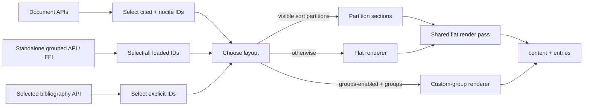

# Bibliography Rendering Pipeline

**Status:** Active
**Version:** 1.1
**Date:** 2026-07-11
**Related:** beans `csl26-plaz`, `csl26-mnoo`, `csl26-f9ri`; `BIBLIOGRAPHY_GROUPING.md`

## Purpose

This specification defines how bibliography APIs select eligible references, choose a layout,
and derive rendered content and per-entry data. Selection and layout are independent decisions:
whether an API renders cited or all loaded references must not change because manual groups or
automatic partition sections are configured.

## Scope

This covers document-context bibliography rendering, the standalone grouped API, its FFI
wrappers, and explicitly selected bibliography rendering. The public document-level `allrefs`
option and `nocite: @*` syntax remain reserved for `csl26-f9ri`.

## Design

### Pipeline

### Selection rules

| API surface | Eligible references | Result |
|---|---|---|
| `format_bibliography`, `process_document`, `DocumentSession` | IDs cited in-text or registered through `nocite` | `DocumentBibliography` |
| `render_grouped_bibliography_with_format*` and `citum_render_bibliography_grouped_*` | All loaded references, regardless of the run's cited IDs | `String` |
| `render_selected_bibliography_with_format*` | Caller-supplied IDs | `String` |
| Reserved document `allrefs` hook | All loaded references | `DocumentBibliography` |

The internal `restrict_to_cited` flag therefore controls selection only. `true` selects the
document's cited and `nocite` IDs; `false` selects the full loaded library.

### Layout precedence

After selection, rendering chooses exactly one layout:

1. Manual `bibliography.groups` when `groups_enabled` is `true`.
2. Automatic `sort_partitioning` sections when configured for visible sections.
3. Flat rendering.

Setting `groups_enabled: false` disables only manual groups. A retained `groups:` block is
ignored, and automatic partition sections remain eligible.

### Shared flat and partition rendering

Flat and automatic-partition layouts render each eligible reference template once. The pass
produces globally sorted, unmerged `entries`; `content` is then derived from those rendered
templates. Partition content applies subsequent-author substitution independently in each
section so substitution state resets at section boundaries.

Custom groups remain separate because group-local templates, sorting, and disambiguation cannot
be represented by one flat entry list.

### Compound-numeric exception

Active compound-numeric groups keep a dedicated content path. Merging may require configured
group members beyond the document's cited subset, while document `entries` remain cited-only and
unmerged. Automatic partition sections merge compound members within each rendered partition.

## Implementation Notes

- `Processor::effective_custom_groups` is the single gate for enabled manual groups.
- `Processor::render_flat_bibliography` is shared by document and grouped rendering when no
  custom or compound-numeric groups are active.
- FFI grouped rendering finalizes a clone of the live run, but still requests all loaded
  references; existing cited IDs affect selectors, not eligibility.

## Acceptance Criteria

- [x] Disabled manual groups render a flat full-library standalone bibliography.
- [x] Grouped rendering against a live run includes cited and uncited references.
- [x] Disabled manual groups fall through to automatic partition sections.
- [x] Document bibliography output remains restricted to cited and `nocite` references.
- [x] Flat and partition content preserve substitution, annotation, numbering, and compound
      behavior.

## Changelog

- v1.1 (2026-07-11): Separate selection from layout and define disabled-group, standalone,
  FFI, shared-renderer, and compound behavior (`csl26-mnoo`).
- v1.0 (2026-07-11): Consolidate document bibliography rendering (`csl26-plaz`).
