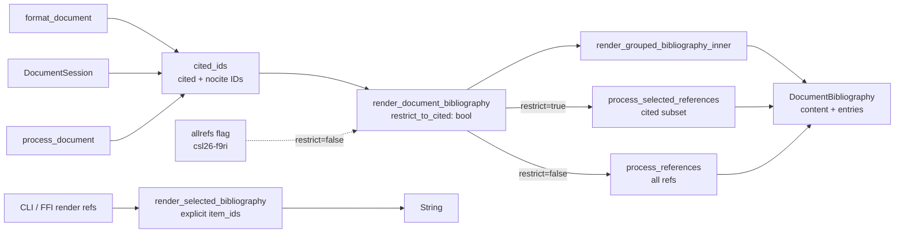

# Bibliography Rendering Pipeline

Status: Active

## Overview

This document describes the consolidated bibliography rendering pipeline introduced in the
`refactor(engine): unify document bibliography rendering` refactor. It is the authoritative
reference for how the three document-context API surfaces route to a single rendering facade,
how the document-free (standalone) path stays separate, and where the reserved `allrefs`
escape hatch fits.

## Pipeline Diagram

## Routing Rules

| Call site | restrict_to_cited | Returns |
|---|---|---|
| `format_bibliography` (batch, session) | `true` | `DocumentBibliography` (content + entries) |
| `pipeline.rs` `process_document_with_default_bibliography` | `true` | `.content` only |
| `render_refs` / FFI / standalone CLI | — (explicit `item_ids`) | `String` |
| `allrefs` flag (csl26-f9ri, reserved) | `false` | `DocumentBibliography` |

## Content engine sub-paths (`render_grouped_bibliography_inner`)

1. **Custom groups** (`style.bibliography.groups` defined) → `render_with_custom_groups_filtered`
2. **Sort partitioning** (`bibliography.sort_partitioning` with `render_sections: true`) → `render_with_partition_sections`
3. **Flat fallback** (no groups, no partitioning) → `render_with_legacy_grouping`

All three sub-paths honour `restrict_to_cited` — cited IDs come from `self.cited_ids`
(populated by the citation pipeline and `register_nocite_ids`).

## Per-entry data consistency

`entries` are computed by `process_selected_references_with_format` over the same cited
subset that `render_grouped_bibliography_inner` uses for `content`. This guarantees that
subsequent-author substitution (e.g. `———`) sees only the cited subset in both outputs.

## Document-free path

`render_bibliography_with_format`, `render_selected_bibliography_with_format_and_annotations`,
and the standalone CLI (`human.rs`) bypass `render_document_bibliography` entirely. They
call `render_selected_bibliography_with_format_and_annotations` with an explicit `item_ids`
set and do not read `cited_ids`. These paths are unchanged by this refactor.

## Reserved: `allrefs` flag (csl26-f9ri)

Passing `restrict_to_cited = false` to `render_document_bibliography` makes every loaded
reference eligible — the `allrefs` escape hatch for printing a bibliography without a
document context. The engine hook is in place; the public API surface (`allrefs: bool` on
`FormatDocumentRequest` / session, and the `@*` Pandoc wildcard in `nocite`) is deferred
to csl26-f9ri.

## Related specs

- [NOCITE_BIBLIOGRAPHY_ONLY_ENTRIES.md](NOCITE_BIBLIOGRAPHY_ONLY_ENTRIES.md) — nocite
  semantics and API surface; `register_nocite_ids` feeds `cited_ids` that gate the
  document bibliography.
