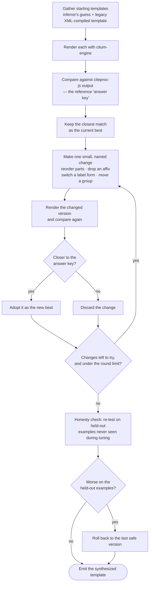

# Output-Driven Template Synthesis

**Status:** Active (Phases 1–2 shipped)
**Date:** 2026-06-11 (Phase 2 design added 2026-06-12)
**Bean:** `csl26-aynr` (Phase 1 + prerequisites), `csl26-8txa` (Phase 2 loop)
**Related:** `docs/specs/EMBEDDED_JS_TEMPLATE_INFERENCE.md`, `docs/architecture/audits/2026-06-11_MIGRATE_IMPROVEMENT_WAVE_OUTCOME.md`

## Purpose

Raise `citum-migrate` fidelity by selecting — and ultimately synthesizing —
generated templates from rendered output evidence instead of trusting the
structural CSL XML layout compiler.

## Problem

CSL layout XML is procedural. Citum templates are declarative. The existing
migrator can extract CSL metadata and options reliably, but compiling the CSL
layout tree into declarative bibliography and citation templates creates
repeated fidelity defects: component order drift, conditional leakage, lost
affixes, and note-position mismatches.

The converter already has the two engines needed to choose better output:

- the embedded citeproc-js runtime renders the CSL reference output
- `citum-engine` renders candidate Citum styles

The missing mechanism is a deterministic candidate-selection loop that scores
candidate templates against citeproc output before emission. Phase 1 built the
bounded form of that loop; Phase 2 generalizes it into full template synthesis
so the XML layout tree is never compiled as authority.

## Phase 1 — Bounded measured-candidate selection (shipped)

### Scope

In scope:

- render citeproc-js bibliography and citation reference strings in-process
- render candidate Citum styles with `citum-engine`
- score citation candidates with raw token Jaccard to preserve label behavior
- score bibliography candidates with oracle-compatible normalization, including
  case-only mismatch rejection and greedy entry pairing
- choose the higher-pass candidate, or require a clear similarity margin on
  pass-count ties
- generate a bounded set of typed bibliography patch candidates
- preserve XML extraction for declarative attributes and options

Out of scope for Phase 1:

- LLM-assisted template authoring
- replacing citeproc-js verification scripts
- changing public style schema
- unbounded mutation search
- wrapper minimization policy changes

### Design

The first vertical slice generalizes the measured citation selector into a
bounded measured-candidate selector:

1. Resolve the inferred templates and compile the XML fallback as today.
2. Assemble the normal standalone candidate.
3. Select citation output first, comparing the inferred/current style, XML
   fallback, and bounded citation-local mutations.
4. Assemble an alternate candidate with the inferred bibliography masked so the
   bibliography comes from the XML fallback.
5. Generate deterministic bibliography candidates from typed patch families:
   XML source selection, contributor case, type-local default, date
   granularity, and article-journal suppression.
6. Render citeproc-js bibliography reference strings from the embedded runtime.
7. Render candidates with `citum-engine` in plain text.
8. Keep the incumbent unless a candidate wins on pass count or clears the tie
   margin on summed similarity.

This does not make XML compilation authoritative. It treats XML output as one
candidate in a measured search space. Mutation search is deliberately
non-combinatorial in this implementation: every candidate is a single named
patch with a family, affected section, and affected reference types.

### Failure modes

- Reference-entry mapping can fail for styles whose bibliography output lacks
  enough title, name, or year signal. Such entries are skipped for selection
  rather than guessed.
- Candidate scoring can prefer XML when the current fixture surface is too
  narrow. The tie margin prevents equal-pass noise from flipping the inferred
  default.
- Engine defects remain possible. If both candidates score poorly and the
  oracle diff shows correct template data rendered incorrectly, route the gap
  to `citum-engine`.

## Phase 2 — Full template synthesis (shipped)

Phase 2 retires XML layout compilation as the template authority. Citum
templates are synthesized by a deterministic propose/render/score/mutate loop
searching the candidate space against citeproc-js reference output. The CSL
XML is read only for declarative attributes and options (et-al thresholds,
`initialize-with`, sort keys, disambiguation and demotion options); the layout
tree is never compiled as authority. During the transition the XML-compiled
templates survive only as one seed candidate in the search space.
Disambiguation is not synthesized from rendered output; it is extracted as
class-based `Processing` configuration and folded to named presets as described
in [`docs/reference/PROCESSING_MIGRATION.md`](../reference/PROCESSING_MIGRATION.md).

### How synthesis works, in plain terms

For reviewers who author CSL styles rather than read Rust: the loop refines a
style the way a careful editor would — by trial and error — but automatically
and deterministically.

It starts from one or more *draft* templates: the inferrer's best guess at the
Citum template, plus the template the legacy XML compiler would produce. It
renders each draft with `citum-engine` and compares the result against the
output **citeproc-js** produces for the same references. citeproc-js output is
treated as the **answer key** — the closer a draft's rendered citations and
bibliography are to it, the better that draft scores.

The best-scoring draft becomes the **working version**. The loop then makes one
small, well-defined change at a time — reordering two adjacent parts, dropping a
stray prefix or suffix, switching a label between long / short / symbol forms,
or moving a group boundary — renders the changed version, and compares again. A
change is kept only if it moves the output *closer* to the answer key;
otherwise it is thrown away. This repeats until no change helps or a fixed round
limit is reached.

Finally, the winning template faces an **honesty check**: it is re-tested on a
separate batch of references deliberately held back during tuning. If it does
worse on those, the loop concludes it over-fit to the examples it could see and
rolls back to the last version that held up. Only then is the template emitted.

Everything is deterministic — no randomness, no AI in the loop — so identical
inputs always produce an identical template.

| Term used below | Plain meaning |
|---|---|
| seed | a starting-point draft template — the inferrer's guess or the legacy XML-compiled template |
| reference output | the citation/bibliography text citeproc-js produces, used as the answer key |
| score / fitness | how closely a candidate's rendered output matches the reference output |
| incumbent | the current best template — the one a proposed change must beat |
| mutation | one small, named change to a template |
| held-out set | reference examples withheld during tuning, used as a final over-fitting check |



### Prerequisites

These land before the loop and gate its implementation:

1. **Positional scenario coverage.** Reference and candidate rendering cover
   five citation scenarios per fixture item: first bare, first with page
   locator, subsequent, ibid, and ibid with locator. citeproc-js renders with
   explicit position flags; `citum-engine` mirrors them through
   `citum_schema::citation::Position`. Without positional coverage the loop
   cannot score note-class repeat forms and would overfit to first-position
   output.
2. **Held-out fixture items.** A second fixture set, disjoint from the
   selection set, that the loop never scores against during search. The
   selected candidate is re-rendered on the held-out set after selection and
   its pass-rate reported. A synthesized template that wins on selection items
   but regresses the held-out pass-rate is rejected in favor of the incumbent.
   Held-out items must never feed template inference or candidate scoring.
3. **Bounded mutation space.** Mutation operators are enumerated, typed, and
   non-combinatorial per iteration: component order moves, affix edits
   (prefix/suffix/wrap), label form changes, and group boundary moves. Each
   proposed candidate is a single named mutation applied to the current
   incumbent, never a free recombination.
4. **Explicit candidate budget.** A `CandidateBudget` caps candidates per
   mutation family and total candidate renders per style section, so scoring
   cost cannot become unbounded as operator families grow.

### Loop design

1. Seed the candidate pool with the inferrer output and, during transition,
   the XML-compiled templates.
2. Render citeproc-js reference strings for all citation scenarios and
   bibliography entries on the selection fixture set.
3. Score every seed with the Phase 1 fitness functions (`token_jaccard` for
   citations, oracle-compatible normalized comparison for bibliography); the
   best seed becomes the incumbent.
4. Propose one bounded round of mutations of the incumbent, subject to the
   candidate budget.
5. Render and score the proposals; a proposal replaces the incumbent only
   under the Phase 1 acceptance rule (more passes, or tie with clear summed
   similarity margin).
6. Repeat from step 4 until a fixed iteration cap or a no-improvement cutoff
   is reached.
7. Validate the final incumbent on the held-out fixture set; on held-out
   regression, fall back to the best non-regressing earlier incumbent.

The loop is deterministic: no LLM in the loop, no randomized search; mutation
proposal order is fixed, so identical inputs synthesize identical templates.

### Integration

Phase 2 replaces the default migration path when it lands — no opt-in flag.
The XML layout compiler remains in-tree only as a candidate seed until the
seeded scorecard shows it no longer wins selections, after which it can be
removed. Regression instruments:

- the seeded random-100 scorecard (`--seed 20260610`), headline gate
- the portfolio quality gate (`scripts/report-core.js` +
  `scripts/check-core-quality.js`) for checked-in styles

### Acceptance criteria

- Positional scenarios render through the embedded runtime and the engine
  with matching scenario indices.
- Held-out validation pass-rates are recorded on measured selection results
  and surfaced in debug output.
- Candidate generation is budget-bounded with documented defaults.
- The synthesis loop (`crates/citum-migrate/src/synthesis/`) keeps the seeded
  random-100 scorecard as its headline gate:

```bash
node scripts/report-migrate-sqi.js --corpus random --sample 100 --seed 20260610
```

- Goal state: more than 80 of the 100 sampled styles score at least 90%
  combined strict citation+bibliography fidelity.

### Failure modes

- **Fixture overfitting.** The loop optimizes against a finite fixture
  surface. Mitigated by the held-out validation gate and by keeping mutation
  rounds bounded.
- **Engine-level gaps.** When citeproc output cannot be matched by any
  candidate because `citum-engine` renders correct template data incorrectly,
  no amount of search helps; route the gap to the engine as Phase 1 already
  prescribes.
- **Budget starvation.** Too-tight budgets can stop the loop before it
  reaches obvious wins. Budgets are tunable constants with defaults sized so
  Phase 1 behavior is unchanged.

## Verification

Targeted:

```bash
cargo test -p citum-migrate measured_citation
node scripts/report-migrate-sqi.js --styles zeitschrift-fur-allgemeinmedizin,brazilian-journal-of-psychiatry
```

Gate before commit for Rust changes:

```bash
cargo fmt --check && cargo clippy --all-targets --all-features -- -D warnings && cargo nextest run
```
